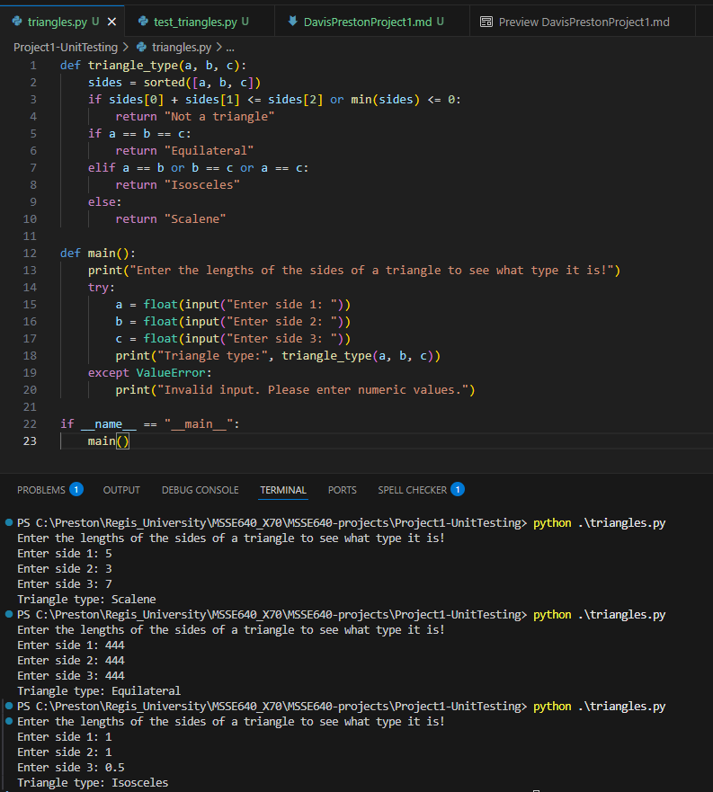
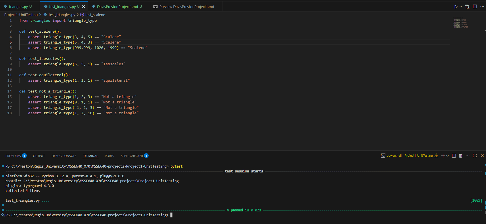

# Project 1 - Unit Testing

## Introduction

The program I wrote for project #1 is called triangles. The program takes 3 floating point numbers as input, which are the three sides of a triangle, and outputs what type of triangle it is. The triangle options are equilateral, isosceles, or scalene. If the sides can't make a triangle, the program instead outputs "Not a triangle".

I used the Python programming language to create this program, so there are a few things that are built in to the language that help me handle errors and perform unit tests, like the "try" and "except" blocks and "assert" for unit tests. I used assertions for all my unit tests in this program just because it is a simple one. Eventually I am sure I will use more complex testing methods with the help of pytest, the most popular Python library for unit testing.

## Details of the program

I used VScode as my IDE to write this program. It has github copilot built in as an AI tool, which is helpful when you just need a quick solve or explanation on something in the code.

The easiest way to get data into a python program without dealing with a file is by prompting for user input in the terminal, so that's what I did with this program. It prompts the user for a number three times, and then outputs the results directly to the terminal, not saving any information.

## Table with example test data

Here is some test data that I put into the program (all of this data goes into my unit tests):

```python
    (3, 4, 5)
    (5, 4, 3)
    (999.999, 1020, 1999)
    (5, 5, 1)
    (1, 1, 1)
    (1, 2, 3)
    (0, 1, 1)
    (-1, 2, 3)
    (1, 2, 10)
```

## Unit Tests

I created four different unit tests, one for each expected outcome of the triangle_type function. I did this so I could break up the testing into smaller pieces, which would help find the error in the code quicker because the testing is related to the specific output and therefore the block of code that runs that would create that output. Here are my tests, broken up into four parts:

```python
def test_scalene():
    assert triangle_type(3, 4, 5) == "Scalene"
    assert triangle_type(5, 4, 3) == "Scalene"
    assert triangle_type(999.999, 1020, 1999) == "Scalene"

def test_isosceles():
    assert triangle_type(5, 5, 1) == "Isosceles"

def test_equilateral():
    assert triangle_type(1, 1, 1) == "Equilateral"

def test_not_a_triangle():
    assert triangle_type(1, 2, 3) == "Not a triangle"
    assert triangle_type(0, 1, 1) == "Not a triangle"
    assert triangle_type(-1, 2, 3) == "Not a triangle"
    assert triangle_type(1, 2, 10) == "Not a triangle"
```

## Bugs encountered during testing

At first I thought I had a bug in the program because the program was outputting a valid triangle type when I thought it should be invalid, but then I realized the triangles could have any angles they need to make a triangle, so in my mind I was actually constraining the program more than I was supposed to be! A good reminder to always know the requirements before creating or testing a program.

## Problems

One problem I had was I realized I was pretty rusty at geometry and didn't really know how to validate if a triangle was actually a triangle by just the 3 given sides. I asked AI for help and it gave me these lines of code:

```python
sides = sorted([a, b, c])
if sides[0] + sides[1] <= sides[2] or min(sides) <= 0:
return "Not a triangle"
```

And it also explained to me what these lines of code are doing! This was it's explanation:

"This code checks whether three given side lengths can form a valid triangle. It does so by evaluating two important conditions:

Triangle Inequality Theorem: The sum of the lengths of any two sides of a triangle must be greater than the length of the third side. In this code, sides[0] + sides[1] <= sides[2] checks if the sum of the first two sides is less than or equal to the third side. If this condition is true, the sides cannot form a triangle.

Positive Side Lengths: All sides of a triangle must have positive lengths. The expression min(sides) <= 0 checks if any of the side lengths are zero or negative. If so, the sides are invalid for a triangle.

If either of these conditions is met, the function returns the string "Not a triangle", indicating that the provided side lengths do not satisfy the requirements to form a triangle. This helps prevent invalid geometric calculations later in the code."

It's so awesome to get a solution to my problem and also have it explained to me in such a clear way. There are so many helpful tips AI can share, and that is now another solution I can add to my tool belt when I run into a similar issue.

## Screen Shots

Successful program runs:



Successful unit test runs:



## Git Hub Link

https://github.com/prestond28/MSSE640-projects

## Recommendations

I don't have a ton to say about any recommendations, I thought the assignment was very detailed and explained exactly what needed to be done! I am still fairly new to software engineering and programming in general, so hopefully I'll have more recommendations as I progress through the course and receive feedback on my assignments.