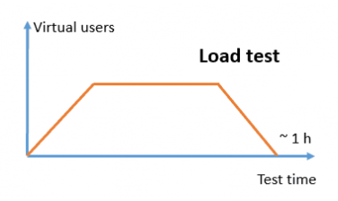
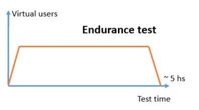
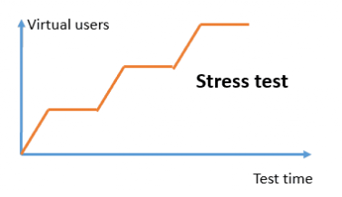
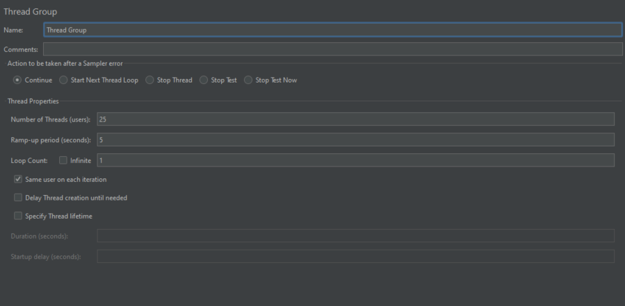
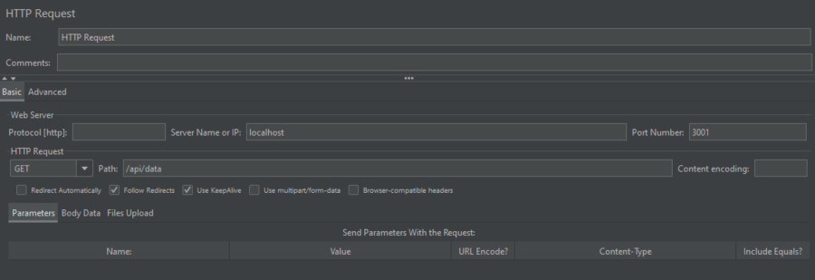
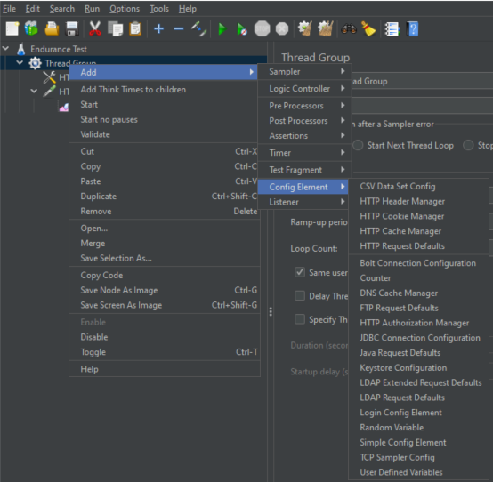
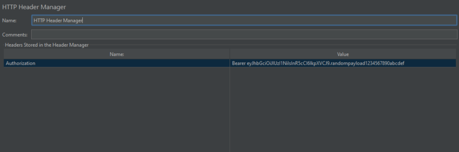
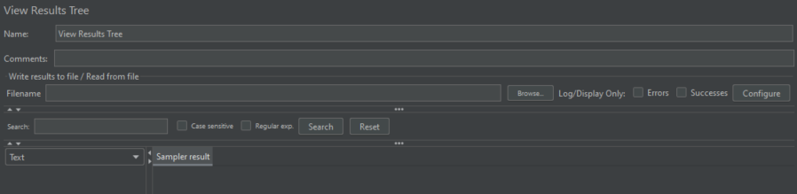

# Project 3 - Performance Testing

## Introduction

In this project, I researched the basics of performance testing and JMeter and how to run a simple performance test of an application I made for an earlier class. Part 1 covers what I learned during my research, and part 2 has a video of the testing I did using JMeter. 

## Part 1 - Research on Performance Testing and JMeter

### Load Testing
Load testing measures the performance of a system under expected user loads. This test is usually to see how the response time and stability of a system performs as the number of threads gradually increases.

### Endurance Testing
Endurance testing can be implied from the name. This test puts a significant load on the system for a prolonged period of time to find issues that occur only after an extended period of time, such as memory leaks or performance degradation.

### Stress Testing
Stress testing evaluates how a system handles spikes in loads. This test usually goes beyond the system's breaking point to see if it can recover well from extreme conditions.

### Thread Groups
Thread groups are the main unit of measurement in JMeter. They define the number of users, or "threads", that will be used in the test and how quickly the number of threads start to ramp up to simulate a realistic load on the system.

Here is an example one in JMeter:

### HTTP Request Sampler
An HTTP request sampler is what is used to send HTTP or HTTPS requests to a web server. It lets you specify all the necessary information such as the request method, parameters, headers, etc. The HTTP request sampler simulates API calls that the system may normally receive.

### Config Elements
Config elements are JMeter's way to help you customize the settings of the test. For example, if you wanted to add parameters or variables to make the tests more maintainable you could do that with config elements.

One example is if you wanted to add headers to your http request, you could do that! First, right click on the thread group and follow the menu:

Then, this is what it would look like if you had selected an http header manager config element and put an authorization header in your http request:

### Listeners
Listeners collect the results from your test executions and display them in tables, graphs, or logs to help you analyze the system's performance and identify issues.

Example:

### Application Performance Index
An application performance index (or Apdex) is a metric that has been standardized across the industry and it is used to measure user satisfaction with the performance of an application. This is the formula:

Apdex = (Number of Satisfied Samples + (Number of Tolerating Samples / 2)) / Total Samples

A sample can have a score of satisfied, tolerating, or frustrated. A score of satisfied means the request was completed within the target time. A score of tolerating means the request took longer than the target time but less than 4 times the target time. And a score of frustrated means the request took longer than 4 times the target time.

The Apdex score ranges between 1 and 0. Receiving a 1 means all users were satisfied with the performance of your application.

## Part 2 - Video Demonstration

<video width="600" controls>
  <source src="./videos/jmeter_demo.mp4" type="video/mp4">
</video>

## Conclusion

I learned quite a bit about APIs in previous courses, and they were so confusing to me for a long time. But now that I understand them, they really are quite simple! I like how easy JMeter makes it to add a HTTP request and how easy it is to understand where to put all the configurations to make the request work. I hadn't known really anything at all about performance testing before this project, but I'm glad this project existed to help me learn about it! I think the most important thing I learned is that performance testing isn't just a "nice to have" once your application is finished, but it's an essential part of testing that you need to do to make sure your application doesn't crash under certain loads once it's released to public users.

I don't have much feedback that would help improve this assignment, but I do have good feedback. I like how part one has you research the important performance tests and the basics of JMeter. I feel like when I got to part two, I had no issues feeling confident using JMeter because part one prepared me pretty well!