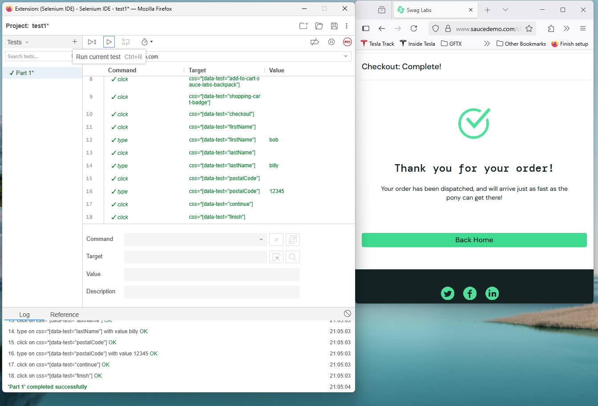
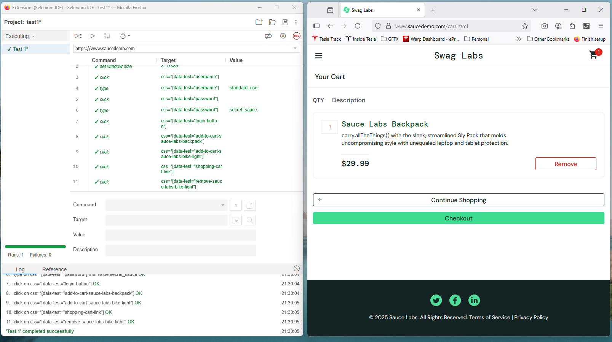

# Project 4 - User Testing

## Introduction

For this project, I installed Selenium IDE as an extension on firefox. Unfortunately the IDE extension for chrome no longer worked, so I used the firefox extension for my entire project. I also unfortunately did not have time to manually write every test, so I recorded my user inputs with the Selenium IDE and then ran the tests with the recorded actions to see if they would output the same result.

## Part 1

For part 1, I used a test website that was recommended in slack -> https://www.saucedemo.com/. I ran a test that logged in, added an item to the cart, and checked out with the selected item:

## Part 2

I used this website for all of the following tests: https://www.saucedemo.com/
### Test 1

#### User story

- Login / verify user logged in
- Add two different items to your cart / verify items are in shopping cart and cost is calculated correctly
- Remove one item from the cart / verify cost updates to reflect correct amount

### Test 2

#### User story

- Login / verify user logged in
- Add an items to your cart / verify item is in shopping cart and cost is calculated correctly
- Log out / verify log out was successful
- Log back in / verify item is still in your shopping cart

### Test 3

#### User story

- Filter items with price from high to low / confirm order of items on page is correct
- Add highest priced item to cart and click checkout / confirm you were navigated to the checkout form with the item
- Fill out form properly and click continue / verify checkout overview page displays proper items and prices
- Complete checkout / confirm thank you page appears to user

## Conclusion

I learned how to use the Selenium IDE extension for firefox, and I thought it was pretty cool to finally find something that tested the front end of an application. I learned that you can record user interactions once, and then save that test for later repeated automated tests! Unfortunately I ran out of time, or I would like to have learned more of the actual writing of Selenium tests using Python or JavaScript.